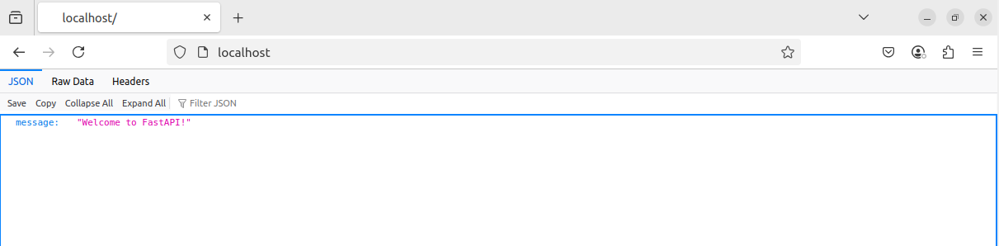
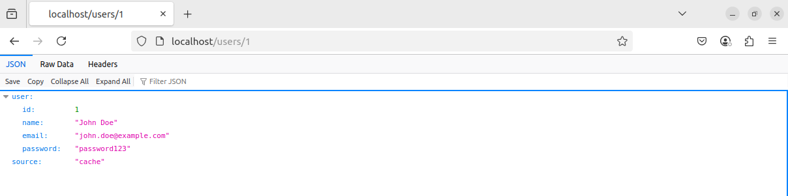
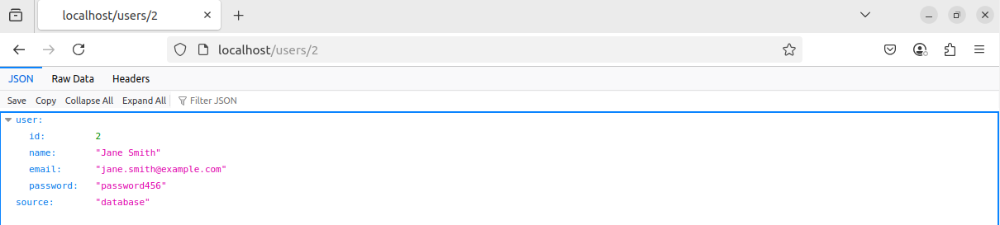

## Overview

This project is a Dockerized FastAPI web application that manages users and routes with PostgreSQL for persistent storage and Redis for caching. The application also uses NGINX as a reverse proxy to handle incoming traffic.

## Architecture

The architecture of this application is designed to be highly scalable, using the following components:

1. **FastAPI (Backend)**: Handles API requests, interacts with PostgreSQL, and caches data in Redis.
2. **PostgreSQL (Database)**: Stores persistent data such as user information.
3. **Redis (Cache)**: Used for caching frequently accessed data to speed up responses.
4. **NGINX (Reverse Proxy)**: Routes incoming traffic to the FastAPI service.
5. **Docker Compose**: Manages multi-container deployments.

### Technologies Used

- **Backend**: FastAPI
- **Database**: PostgreSQL
- **Cache**: Redis
- **Reverse Proxy**: NGINX
- **Containerization**: Docker, Docker Compose


## Installation

### Prerequisites

- **Docker**: Ensure Docker and Docker Compose are installed on your system.
- **Environment Variables**: Ensure you set the environment variables for database and Redis URLs.

### Steps to Run Locally

1. Clone the repository:

   ```bash
   git clone https://github.com/yourusername/route-docker-end-project.git
   cd route-docker-end-project
   
2. Build and start the Docker containers using Docker Compose:

   ```bash
   sudo docker-compose up --build
   
3. Once the services are up and running, access the app via:

   ```bash
   (http://localhost:80)
   
### Initial Setup (Database)

1. Run the following command to access the PostgreSQL container:

   ```bash
   git clone https://github.com/yourusername/route-docker-end-project.git
   cd route-docker-end-project
   
2. Create the users table:

   ```sql
   CREATE TABLE users (
    id SERIAL PRIMARY KEY,
    name VARCHAR(100),
    email VARCHAR(100),
    password VARCHAR(100)
);
   
3. Insert some sample data:

   ```sql
   INSERT INTO users (id, name, email, password)
VALUES
(1, 'John Doe', 'john.doe@example.com', 'password123'),
(2, 'Jane Smith', 'jane.smith@example.com', 'password456');
)

## Security Scans

### Trivy Scan Results

We have performed a vulnerability scan using #Trivy

| Severity Level | Count |
|----------------|-------|
| High           | 1     |
| Medium         | 0     |
| Low            | 0     |
| **Total**      | **1** |

**Detailed Report:**  
For complete details, please refer to the [scan_report.txt](./scan_report.txt) file.

## Screenshots

### Runtime Screenshots

Here are some screenshots of the app running:

#### Home Page



#### Redis Cache Example



#### Database Cache Example



